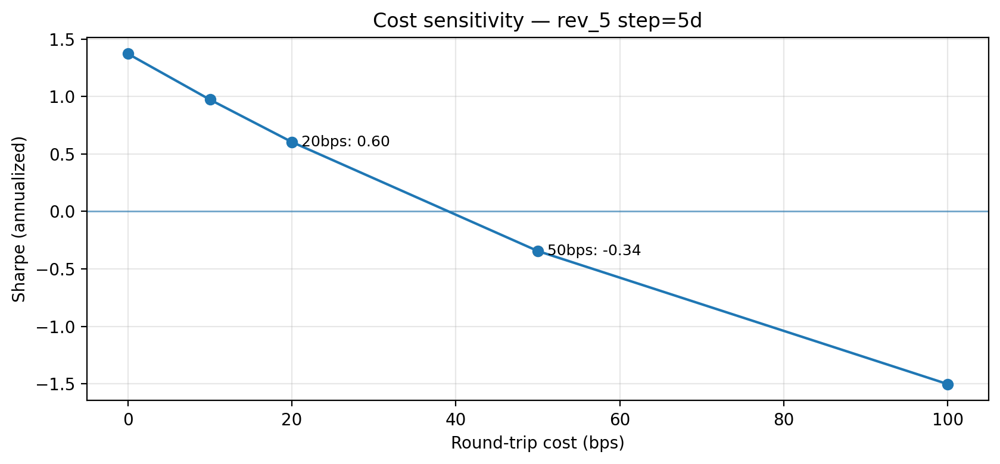

# Equity Factor Research Pipeline (Demo)

A reproducible **cross-sectional equity factor research pipeline**:

**download → panel alignment → factor construction → cross-sectional preprocessing → IC/RankIC diagnostics → cost-aware long/short backtests**

This repo is intentionally portfolio-quality: clear assumptions, reproducible scripts, and transparent limitations.

## What this repo does
- Downloads daily OHLCV from Yahoo Finance via `yfinance`
- Builds an aligned panel and forward-return labels (H = 1/5/10/20)
- Constructs interpretable baseline factors (momentum / reversal / volatility / liquidity proxies)
- Applies daily cross-sectional preprocessing (winsorize + z-score)
- Evaluates signals via **IC / RankIC**, horizon decay, and quantile spread tests
- Runs cost-aware long/short backtests, including a **5-day step backtest aligned to `fwd_ret_5d`**

## Results snapshot (current demo)
- **Universe / sample:** 130 tech-tilted US equities × 1,870 trading days; **q=5**
- **Costs:** constant **20 bps** round-trip × turnover
- **Signal (rev_5):** positive RankIC across horizons (see `results/ic_summary_sample.csv`)
- **Aligned backtest (step=5d, uses `fwd_ret_5d`):** **Sharpe 0.60**, **AnnRet 15.63%**, **MaxDD -29.36%** (cost-adjusted, 20 bps)
- **Cost sensitivity:** Sharpe drops rapidly; performance flips negative around **50 bps** (see `results/cost_sensitivity_rev_5_step5_sample.csv`)




> Configuration is controlled via `config.yaml` (local, not committed). See `config.example.yaml` for defaults.


## Repo structure (actual)
```text
equity-factor-pipeline/
├── scripts/
│   ├── 00_download.py                 # Download OHLCV into data/raw/
│   ├── 01_build_panel.py              # Build aligned panel + forward-return labels
│   ├── 02_preprocess.py               # Factors + winsorize/zscore -> panel_factors.parquet
│   ├── 03_evaluate.py                 # IC/RankIC, decay, quantile spread -> results/*.csv
│   └── 04_backtest.py                 # Backtests (daily or step=5d) -> results/backtest_*.csv
├── data/
│   ├── .gitkeep                       # Keep folder in repo (no data committed)
│   └── tickers.csv                    # Local universe list (typically NOT committed)
├── results/
│   ├── ic_summary_sample.csv          # Small sample output (committed)
│   └── backtest_rev_5_step5_sample.csv# Small sample output (committed)
├── config.example.yaml                # Config template (committed)
├── config.yaml                        # Local config (NOT committed)
├── requirements.txt                   # Dependencies (committed)
├── report.md                          # 1-page write-up (committed)
├── .gitignore                         # Ignore local data/config, keep samples (committed)
└── README.md
```

## Quickstart (macOS / zsh)

### 1) Create and activate a virtual environment
```bash
python3 -m venv .venv
source .venv/bin/activate
```

### 2) Install dependencies
```bash
pip install -r requirements.txt
pip install pyarrow
```

### 3) Prepare config + tickers
```bash
cp config.example.yaml config.yaml

# Create your local universe (one column: ticker)
# Example:
echo "ticker
AAPL
MSFT
NVDA" > data/tickers.csv
```

### 4) Run the pipeline (00 → 04)
```bash
python scripts/00_download.py
python scripts/01_build_panel.py
python scripts/02_preprocess.py
python scripts/03_evaluate.py
python scripts/04_backtest.py
```

## Outputs

### Processed data (not committed)
- `data/processed/panel.parquet`
- `data/processed/panel_factors.parquet`

### Factor evaluation tables
- `results/ic_summary.csv` — IC / RankIC mean, IR, t-stat by horizon
- `results/decay_curve.csv` — RankIC vs horizon (decay)
- `results/quantile_spread.csv` — top-minus-bottom spread

### Backtests
- `results/backtest_<factor>.csv` — daily backtest (high turnover; can mismatch horizon)
- `results/backtest_rev_5_step5.csv` — 5-day step backtest aligned to `fwd_ret_5d` (recommended)

### Committed samples (for preview)
- `results/ic_summary_sample.csv`
- `results/backtest_rev_5_step5_sample.csv`

## Important notes
- Raw/processed data and most result CSVs are ignored by git by design.
- For reliable cross-sectional statistics, use **N ≥ 100** tickers and **q = 5**.
- A positive IC does not guarantee profitability under daily rebalancing due to horizon mismatch and costs; this repo includes a **step=5d** backtest to align evaluation targets.

## Report
See `report.md` for assumptions, key results, limitations, and next steps.

## License
MIT
